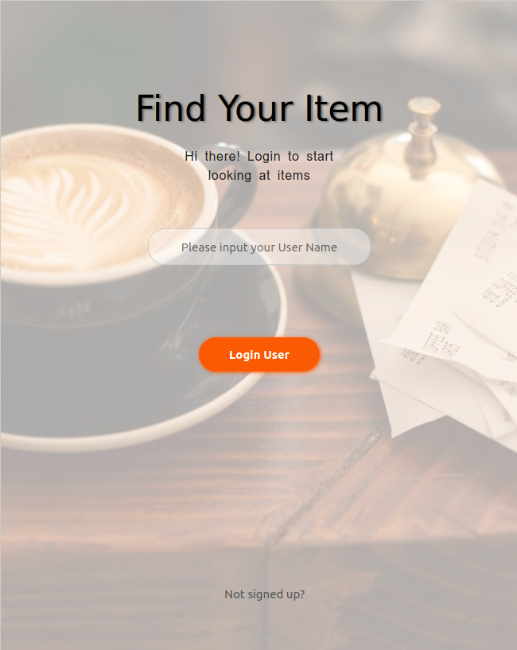
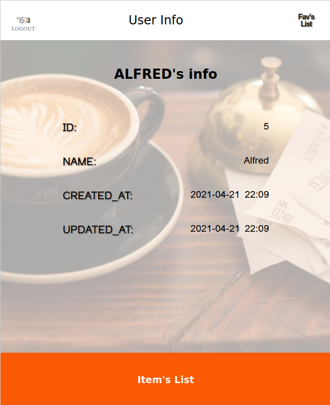
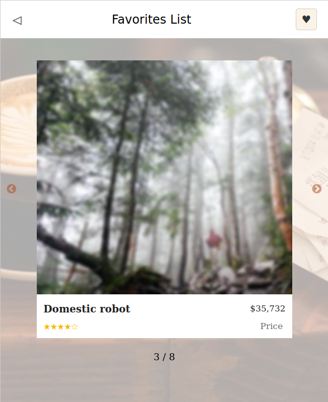
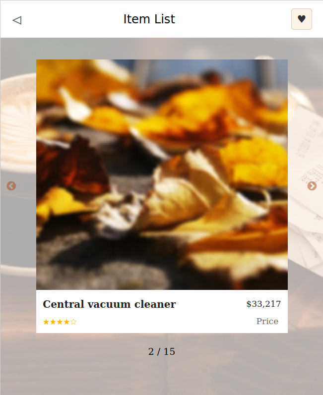
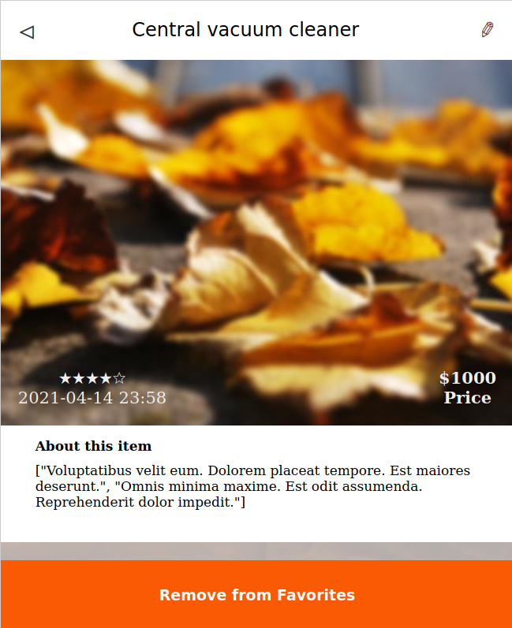

# Find Your Item
This project is a React web app made to view available items and add them or remove them from your favorites list. It connects to a personal API coded with Rail to get the User info as well as the Items and the Favorites List for each User.
Built according to [Microverse's requirements](https://www.notion.so/Final-Capstone-Project-Find-Your-House-9a424802e7dc48eb8ef40e2ac09397d1).
All the information is saved in the BackEnd API.

## Front-End Links
- [GitHub Repo](https://github.com/NewIncome/find_your_item)
- [:globe_with_meridians::computer: Netlify LIVElink](https://find-my-item.netlify.app/)

## Back-End / API Links
- [API GitHub Repo](https://github.com/NewIncome/find-my-item-api)
- [API Live Version](https://findmyitem-api.herokuapp.com)

## Built With 

- REACT
- REDUX
- JavaScript (ES6)
- NPM
- HTML5
- CSS

## Getting Started

In order to start with this project you need the next:

1. Get a copy of this project [this repository :blue_book:](https://github.com/NewIncome/find_your_item/tree/feature/app-w-nodeV12)

Once you have cloned this project
1. Go to project folder
2. run `npm install` or `yarn install`
3. run `npm start`

### Usage

- Enter your **Username** for personalized usage
- Click on the **Item's List** button to see a list of the available items
- You can add items to your Favorites list by clicking the Item and then the **Add to Favorites** button or by pressing the uncolored **heart button** in the Items display
- And by going back to the **User page** you can go to the button **FAVLIST** in the Navbar to view your list of Favorite Items. And also remove them from the list with the **heart button**

## Improvements

Features pending to add to this app:
- add items
- edit items
- remove items

## Acknowledgements
Thanks and inspiration for the Loader from
+ [Andreas Storm](https://codepen.io/avstorm), (tea cup)
+ [Dave McCarthy](https://codepen.io/AsLittleDesign), (loading text)
+ Design idea by [Alexey Savitskiy on Behance](https://www.behance.net/alexey_savitskiy)

## Author
👤 **Jose Alfredo Cardenas**

- Github: [@Jose Alfredo](https://github.com/NewIncome)
- Twitter: [@J_A_fredo](https://twitter.com/J_A_fredo)
- LinkedIn: [Jose Alfredo Cardenas](https://www.linkedin.com/in/j-alfredo-c/)  

## 🤝 Contributing

Contributions, issues, and feature requests are welcome!

## Show your support

If you got until here, show your love hitting the ⭐️ button, greatly appreciated.

## 📝 License

MIT
